<div align="center">

# GURU

**AI Agent Testing & Iteration Platform**

Run, test, and iterate on AI agents in real-time with embedded terminals, version trees, and team orchestration.

[](https://railway.com)

[Live Demo](https://guru-api-production.up.railway.app) | [Report Bug](https://github.com/Antoinecarle/agent-testing-platform/issues) | [Request Feature](https://github.com/Antoinecarle/agent-testing-platform/issues)

</div>

---

## What is GURU?

GURU is a self-hosted platform for managing, testing, and iterating on AI coding agents. It provides a complete workspace where agents execute tasks in real terminal sessions, produce HTML iterations that are automatically captured, and build version trees you can branch from.

Think of it as a **mission control for AI agents** -- assign an agent to a project, watch it work in a live terminal, preview results instantly, and fork iterations to explore different directions.

---

## Screenshots

### Dashboard
> Quick actions, metrics, agent carousel, project grid, activity log, and Guru AI assistant -- all in one view.

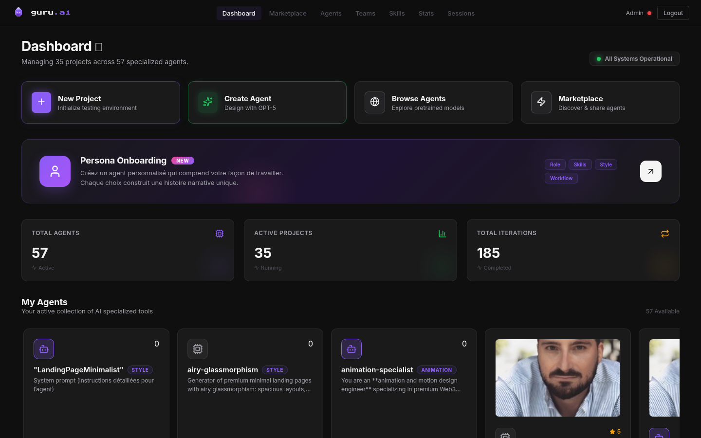

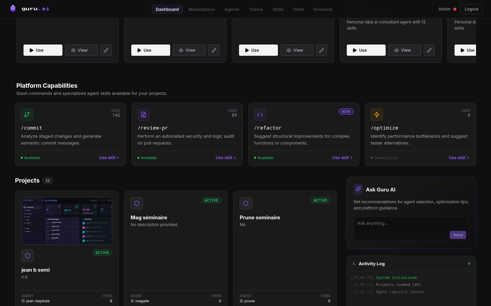

### Project Workspace
> 3-panel layout: iteration tree (left), live preview (center), embedded terminal (right). Branch from any iteration.

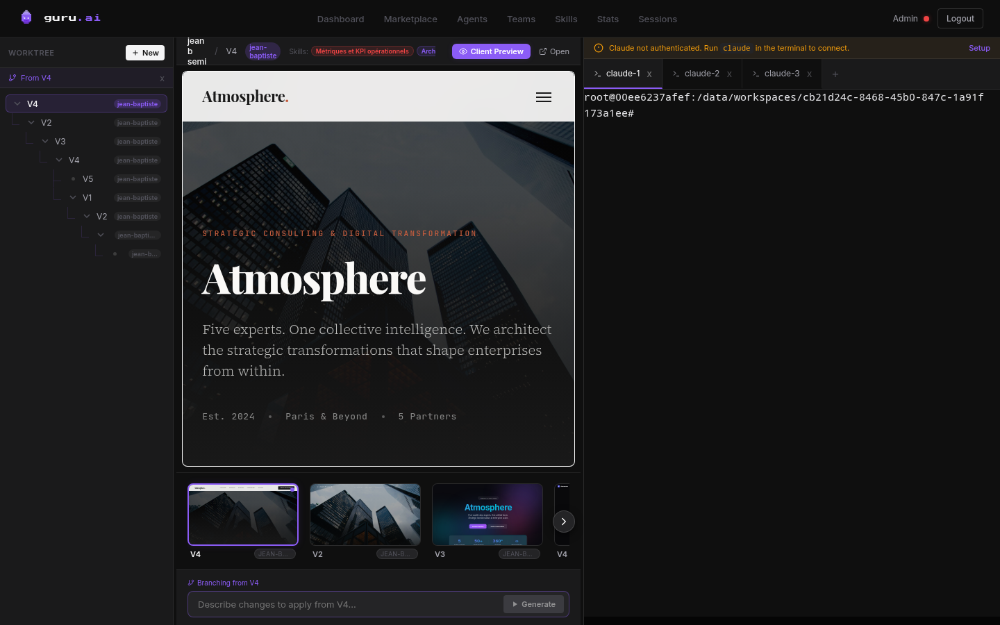

### Agent Browser
> Browse 57+ agents with category sidebar, grid/list views, star ratings, bulk actions, and search.

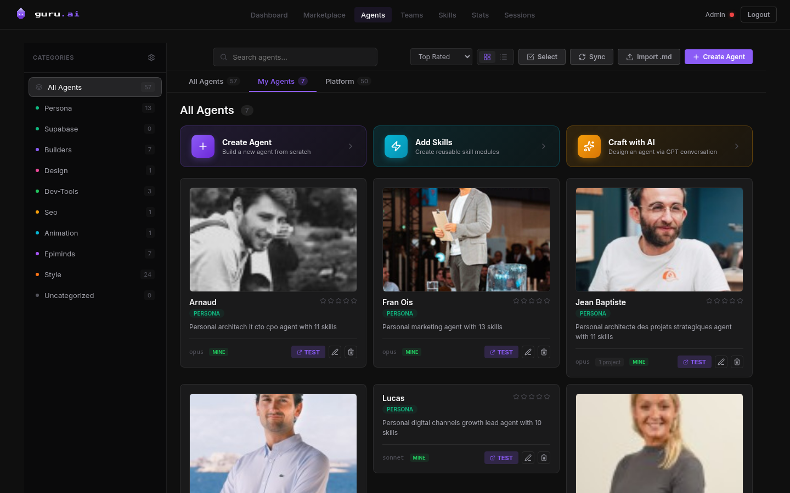

### Agent Creator
> Type-aware agent creation: UX/Design, Frontend, Backend, Marketing, Data & AI, or Custom.

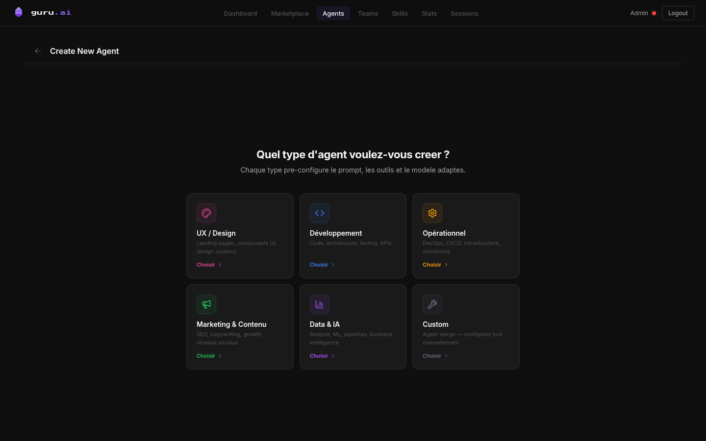

### Agent Marketplace
> Public marketplace with downloads, showcases, category filters, and agent detail pages.

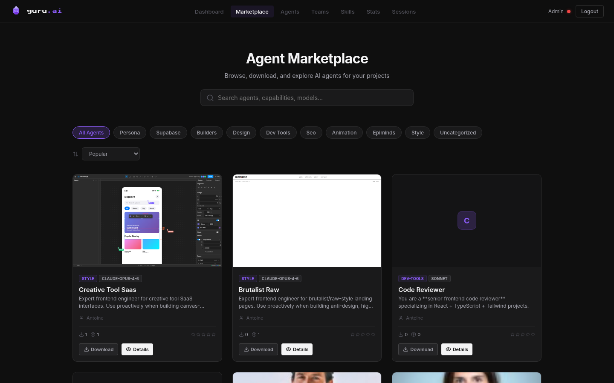

### Skills Manager
> 180+ reusable skills with category tags, search, file trees, and agent assignment.

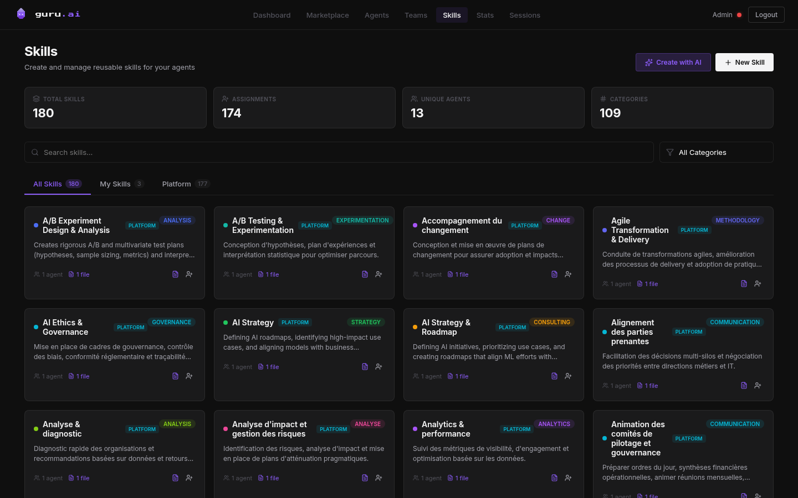

### Agent Statistics
> Real-time analytics: category distribution, source analysis, model usage, top-rated agents.

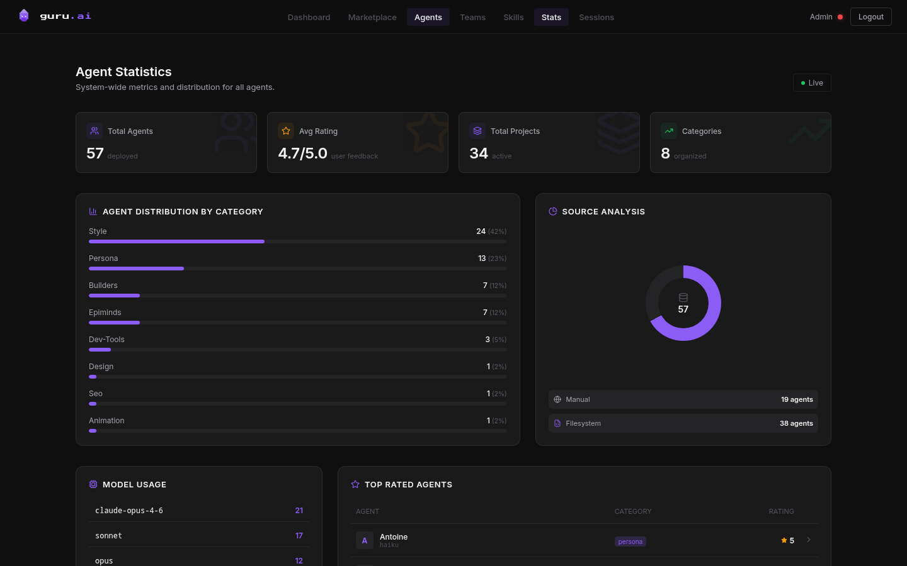

### Agent Teams
> Compose multi-agent teams with orchestrator/worker roles for complex projects.

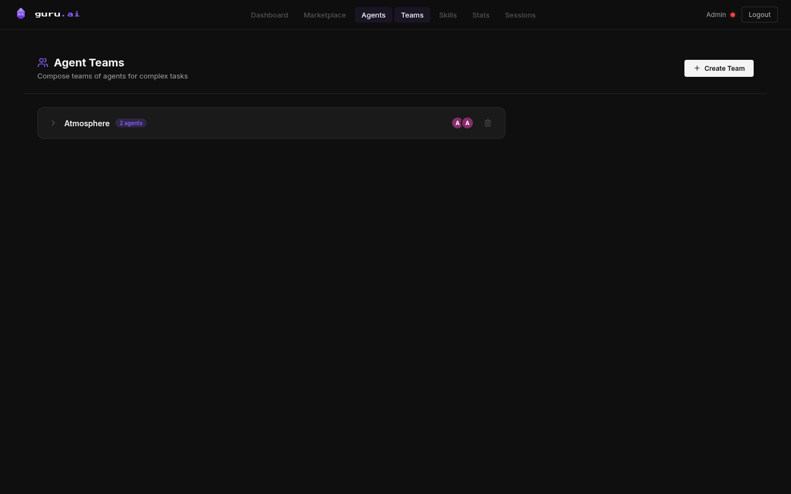

### Session Manager
> View and manage all active terminal sessions across projects.

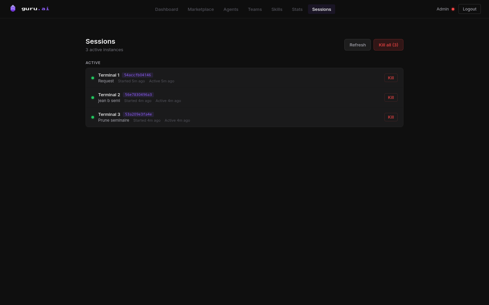

### Authentication
> Clean, dark-themed login with JWT auth and user registration.

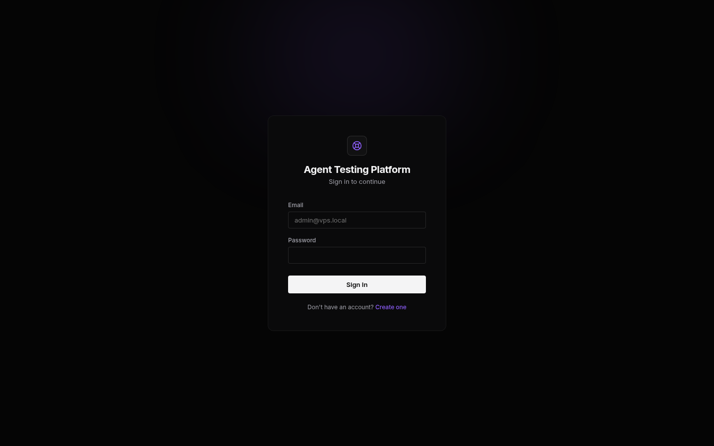

---

## Features

### 1. Agent Library (57+ agents)
Browse, search, and manage a growing library of specialized AI agents. Each agent has:
- A prompt file (`.md`) with YAML front matter
- Model assignment (Claude Opus, Sonnet, Haiku)
- Category, rating, and usage stats
- Version history for prompt edits
- Screenshot/thumbnail support

Create new agents from the UI with AI-powered prompt generation, import `.md` files, or write them manually. Agents are synced between filesystem and database on startup.

### 2. Real-Time Terminals
Every project gets embedded terminal tabs powered by `node-pty` and Socket.IO:
- Full shell sessions (not a simulation) inside isolated workspace dirs
- Per-user Claude CLI credentials and HOME directories
- Multi-tab support with persistent layout across sessions
- Scrollback history (50KB buffer)
- Auto-resize and real-time I/O streaming
- Up to 15 concurrent sessions with 24h idle timeout

### 3. Iteration Tree & Versioning
Agents produce HTML files that are automatically detected and versioned:
- **File Watcher** polls workspaces every 5-10s for new `.html` files
- Content-hash deduplication prevents duplicate imports
- Tree structure with parent-child relationships (not flat)
- Branch from any iteration to explore alternatives
- Branch context stored in `.branch-context.json`
- Each iteration is a self-contained, downloadable HTML file
- Thumbnail carousel for quick visual comparison

### 4. Orchestra Mode (Multi-Agent Teams)
Compose teams of multiple agents with defined roles:
- **Orchestrator** (leader) + **Workers** (members) architecture
- Visual team builder powered by ReactFlow with drag-and-drop nodes
- Animated edges connecting orchestrator to workers
- Agent picker overlay with search and filtering
- Team runs with timestamped logs (info/error/debug)
- Per-run execution tracking (pending, running, completed, failed)

### 5. Agent Creator & Architect
AI-assisted agent creation with a 4-panel layout:
- **Conversation list** -- manage multiple agent design sessions
- **References panel** -- upload images, documents, add URLs for analysis
- **Chat area** -- conversational agent design with AI assistance
- **Preview pane** -- live `.md` preview with validation (sections, CSS variables, components)
- Type-aware prompts: UX/Design, Frontend, Backend, Marketing, Data & AI, Custom
- Content-aware URL analysis (LinkedIn profiles, websites, design references)
- Structured brief generation with extracted colors, fonts, layouts

### 6. Skills System
Reusable skill modules that extend agent capabilities:
- 180+ platform skills across 109 categories
- Slash commands (`/commit`, `/review-pr`, `/refactor`, `/optimize`)
- Assign skills to agents (bulk or individual)
- Skills synced to user HOME as Claude CLI commands
- File tree structure with documentation per skill
- Create custom skills via AI or manually

### 7. Agent Marketplace
Public storefront for sharing and discovering agents:
- Category-based browsing with search
- Download tracking and showcase galleries
- Agent detail pages with description, model, and examples
- Star ratings and usage statistics

### 8. Persona Onboarding
Interactive wizard to create personalized agents based on:
- Professional role and expertise
- Skills and workflow preferences
- Communication style
- Generates a custom agent tuned to the user

### 9. Client Showcase & Preview
Share iteration results without requiring authentication:
- Public preview URLs per project
- Iteration comparison view
- ZIP download of any iteration
- iframe embedding with CORS support

### 10. Analytics Dashboard
Real-time platform metrics:
- Total agents, projects, iterations counters (animated)
- Agent distribution by category (bar charts)
- Source analysis (manual vs filesystem, donut chart)
- Model usage breakdown
- Top-rated agents leaderboard
- Activity log with timestamps

### 11. Session Management
Monitor and control all terminal instances:
- List all active sessions with project association
- Kill individual sessions or all at once
- Session age and activity tracking
- Auto-cleanup of idle/exited sessions

---

## Tech Stack

| Layer | Technology | Purpose |
|---|---|---|
| **Backend** | Express.js | REST API, static serving |
| **Real-time** | Socket.IO | Terminal I/O streaming |
| **Terminals** | node-pty | Real PTY shell sessions |
| **Frontend** | React + Vite | SPA with HMR |
| **Animations** | Framer Motion | Page transitions, counters |
| **Visual Editor** | ReactFlow | Orchestra team builder |
| **Database** | Supabase (PostgreSQL) | All persistent data |
| **Auth** | JWT + bcryptjs | 30-day token expiry |
| **Deployment** | Railway | Persistent volume at `/data` |
| **AI Runtime** | Claude CLI (Anthropic) | Agent execution engine |

---

## Architecture

```
                    +------------------+
                    |   React Client   |
                    |  (Vite + SPA)    |
                    +--------+---------+
                             |
                    HTTP / WebSocket (Socket.IO)
                             |
                    +--------+---------+
                    |  Express Server  |
                    |  + Socket.IO     |
                    +--------+---------+
                             |
          +------------------+------------------+
          |                  |                  |
   +------+------+   +------+------+   +-------+-------+
   | Supabase DB |   |  File System |   |   node-pty    |
   | (PostgreSQL)|   |  (Workspaces |   | (Terminal PTY)|
   |  12 tables  |   |  Iterations  |   |  Real shells  |
   +-------------+   |  Agents)     |   +---------------+
                      +------+------+
                             |
                      +------+------+
                      | File Watcher|
                      | (Auto-import|
                      |  iterations)|
                      +-------------+
```

### Database Schema (12 tables)

| Table | Purpose |
|---|---|
| `users` | Platform users with Claude auth status |
| `agents` | Agent registry (name, prompt, model, category, rating) |
| `agent_versions` | Version history for agent prompt edits |
| `categories` | Agent categories with color and ordering |
| `projects` | Design projects (solo or orchestra mode) |
| `iterations` | Iteration tree (version, parent_id, file_path, metadata) |
| `sessions` | Active terminal sessions |
| `terminal_tabs` | Persistent terminal tab layout per project |
| `agent_teams` | Named team compositions |
| `agent_team_members` | Team membership (agent + role + order) |
| `team_runs` | Team execution instances with status tracking |
| `team_run_logs` | Timestamped logs from team runs |

---

## Getting Started

### Prerequisites

- Node.js 18+
- A [Supabase](https://supabase.com) project (free tier works)
- [Claude CLI](https://docs.anthropic.com/en/docs/claude-cli) installed (optional, for agent execution)

### Installation

```bash
# Clone the repo
git clone https://github.com/Antoinecarle/agent-testing-platform.git
cd agent-testing-platform

# Install all dependencies (server + client)
npm run install-all

# Create .env
cp .env.example .env
```

### Environment Variables

```env
PORT=4000
SUPABASE_URL=https://your-project.supabase.co
SUPABASE_SERVICE_ROLE_KEY=your-service-role-key
JWT_SECRET=your-jwt-secret
EMAIL=admin@example.com
PASSWORD_HASH=$2a$10$...        # bcrypt hash of admin password
DATA_DIR=./data                  # persistent data directory
```

### Run Locally

```bash
# Build the frontend
npm run build

# Start the server
npm start
```

The app runs at `http://localhost:4000`.

### Seed Demo Data

```bash
npm run seed
```

---

## Deployment

### Railway (Recommended)

1. Create a new Railway project
2. Add a **Volume** mounted at `/data`
3. Connect your GitHub repo
4. Set the environment variables above (set `DATA_DIR=/data`)
5. Deploy -- Railway auto-builds via the `postinstall` script

The platform auto-detects Railway via `RAILWAY_ENVIRONMENT` and adjusts paths accordingly.

### Key Railway behaviors:
- Persistent volume at `/data` for workspaces, iterations, user homes
- Claude CLI installed globally via `postinstall` script
- Terminal user runs as `root` (no separate linux user)
- Polling-based file watcher (5s interval, optimized for container FS)

---

## Project Structure

```
guru/
  agents/                    # 57+ agent prompt files (.md)
  server/
    index.js                 # Express + Socket.IO server + startup pipeline
    db.js                    # Supabase client + 130+ async DB functions
    auth.js                  # JWT authentication (login, register, middleware)
    terminal.js              # node-pty terminal management + Socket.IO events
    watcher.js               # File watcher (auto-imports .html iterations)
    workspace.js             # Per-project CLAUDE.md + agent file generation
    user-home.js             # Per-user HOME dir management + agent sync
    cli/register-iteration.js# CLI fallback for iteration registration
    routes/
      projects.js            # Project CRUD + fork
      iterations.js          # Iteration tree CRUD
      agents.js              # Agent management + filesystem sync
      agent-teams.js         # Multi-agent team composition
      team-runs.js           # Team execution tracking + logs
      categories.js          # Agent category CRUD + reordering
      preview.js             # Iteration preview, showcase, ZIP download
      terminal-tabs.js       # Persistent terminal tab layout
      seed.js                # Demo data import
  client/
    src/
      App.jsx                # Routing (15+ routes)
      api.js                 # API client with JWT interceptor
      pages/
        Dashboard.jsx        # Main dashboard with metrics + projects
        ProjectView.jsx      # 3-panel workspace (tree + preview + terminal)
        AgentBrowser.jsx     # Agent gallery with categories + search
        Login.jsx            # Authentication form
      components/
        AgentCreator.tsx     # 4-panel agent design studio
        OrchestraBuilder.jsx # ReactFlow team visual builder
        TerminalPanel.jsx    # xterm.js terminal integration
        TeamRunPanel.jsx     # Team execution monitoring
        AgentVersionHistory.jsx # Agent prompt version diffs
        CategoryModal.jsx    # Category CRUD modal
        Layout.jsx           # App shell with navigation
        GuruLogo.jsx         # Animated SVG logo
  data/                      # Runtime data (gitignored)
    workspaces/{projectId}/  # Per-project workspace dirs
    iterations/{projectId}/  # Versioned iteration HTML files
    users/{userId}/          # Per-user HOME with .claude/ config
    custom-agents/           # User-created agent .md files
```

---

## How It Works

```
1. Create a Project           Assign agent (solo) or team (orchestra)
         |
2. Workspace Generated        CLAUDE.md + agent files + skills written
         |
3. Agent Runs in Terminal     Real PTY shell in workspace directory
         |
4. Agent Writes index.html    Self-contained HTML with inlined CSS/JS
         |
5. Watcher Detects Change     Content hash dedup, 5-10s polling
         |
6. Iteration Captured         Copied to iterations dir, added to tree
         |
7. Preview & Branch           View in iframe, fork to explore variants
         |
8. Client Showcase            Share public preview URL, download ZIP
```

---

## API Reference

Full REST API with JWT auth. All endpoints under `/api/` require `Authorization: Bearer <token>` header unless noted.

### Authentication
| Method | Path | Description |
|---|---|---|
| POST | `/api/auth/login` | Login with email/password |
| POST | `/api/auth/register` | Register new user |

### Projects
| Method | Path | Description |
|---|---|---|
| GET | `/api/projects` | List all projects |
| POST | `/api/projects` | Create project (solo or orchestra) |
| POST | `/api/projects/fork` | Fork iteration as new project |
| GET | `/api/projects/:id` | Get project detail |
| PUT | `/api/projects/:id` | Update project |
| DELETE | `/api/projects/:id` | Delete project |

### Iterations
| Method | Path | Description |
|---|---|---|
| GET | `/api/iterations/:projectId/tree` | Get iteration tree |
| POST | `/api/iterations` | Create iteration |
| GET | `/api/iterations/detail/:id` | Get single iteration |
| DELETE | `/api/iterations/detail/:id` | Delete iteration |

### Agents
| Method | Path | Description |
|---|---|---|
| GET | `/api/agents` | List agents (search, category filter) |
| POST | `/api/agents` | Create agent |
| POST | `/api/agents/sync` | Sync filesystem to DB |
| GET | `/api/agents/:name` | Get agent details |
| PUT | `/api/agents/:name` | Update agent |
| DELETE | `/api/agents/:name` | Delete agent |
| POST | `/api/agents/:name/duplicate` | Clone agent |
| GET | `/api/agents/:name/versions` | Version history |
| GET | `/api/agents/stats` | Aggregate statistics |
| POST | `/api/agents/bulk-delete` | Bulk delete |
| POST | `/api/agents/bulk-category` | Bulk category change |

### Agent Teams
| Method | Path | Description |
|---|---|---|
| GET | `/api/agent-teams` | List teams |
| POST | `/api/agent-teams` | Create team |
| GET | `/api/agent-teams/:id` | Get team + members |
| PUT | `/api/agent-teams/:id` | Update team |
| DELETE | `/api/agent-teams/:id` | Delete team |
| POST | `/api/agent-teams/:id/members` | Add member |
| PUT | `/api/agent-teams/:id/members/reorder` | Reorder members |
| DELETE | `/api/agent-teams/:id/members/:agent` | Remove member |

### Team Runs
| Method | Path | Description |
|---|---|---|
| POST | `/api/agent-teams/:teamId/runs` | Create run |
| GET | `/api/agent-teams/:teamId/runs` | List runs |
| GET | `/api/agent-teams/:teamId/runs/:runId` | Get run + logs |
| POST | `/api/agent-teams/:teamId/runs/:runId/start` | Start run |
| POST | `/api/agent-teams/:teamId/runs/:runId/complete` | Complete run |
| POST | `/api/agent-teams/:teamId/runs/:runId/log` | Add log entry |

### Categories
| Method | Path | Description |
|---|---|---|
| GET | `/api/categories` | List all |
| POST | `/api/categories` | Create |
| PUT | `/api/categories/reorder` | Batch reorder |
| PUT | `/api/categories/:id` | Update |
| DELETE | `/api/categories/:id` | Delete |

### Preview & Download (Public)
| Method | Path | Description |
|---|---|---|
| GET | `/preview/raw/:projectId/:iterationId` | Raw HTML content |
| GET | `/preview/:projectId/:iterationId` | Framed preview |
| GET | `/preview/showcase/:projectId` | Client showcase |
| GET | `/preview/download/:projectId/:iterationId` | ZIP download |

### Terminal Tabs
| Method | Path | Description |
|---|---|---|
| GET | `/api/terminal-tabs/:projectId` | Get saved tabs + session status |
| POST | `/api/terminal-tabs` | Save/upsert tab |
| PUT | `/api/terminal-tabs/:id/session` | Link tab to session |
| DELETE | `/api/terminal-tabs/:id` | Delete tab |
| POST | `/api/terminal-tabs/:projectId/import` | Trigger manual import |
| POST | `/api/terminal-tabs/:projectId/branch-context` | Set branch parent |

### Workspace
| Method | Path | Description |
|---|---|---|
| POST | `/api/projects/:projectId/scan` | Scan workspace for new HTML |
| GET | `/api/projects/:projectId/workspace-context` | Diagnostic info |
| POST | `/api/projects/:projectId/refresh-workspace` | Regenerate CLAUDE.md |
| GET | `/api/projects/:projectId/skills` | List assigned skills |

### System
| Method | Path | Description |
|---|---|---|
| GET | `/api/claude-status` | Claude CLI availability |
| GET | `/api/claude-auth/status` | User's Claude auth |
| POST | `/api/claude-auth/verify` | Verify Claude OAuth |
| POST | `/api/orchestrator/command` | Execute Claude CLI command |
| GET | `/api/user/me` | Current user info |
| GET | `/api/sessions` | List active terminal sessions |
| DELETE | `/api/sessions/all` | Kill all sessions |
| DELETE | `/api/sessions/:id` | Kill specific session |

---

## Design System

GURU uses a consistent dark theme across all pages:

| Token | Value | Usage |
|---|---|---|
| `bg` | `#0f0f0f` | Page background |
| `surface` | `#1a1a1b` | Card/panel background |
| `surfaceEl` | `#242426` | Elevated surface |
| `violet` | `#8B5CF6` | Primary accent |
| `success` | `#22c55e` | Positive states |
| `warning` | `#f59e0b` | Warning states |
| `danger` | `#ef4444` | Error/delete states |
| `tp` | `#F4F4F5` | Primary text |
| `ts` | `#A1A1AA` | Secondary text |
| `tm` | `#52525B` | Muted text |

**Typography**: JetBrains Mono / Fira Code (monospace), Inter (sans-serif)

**Animations**: Framer Motion stagger children, hover transforms, animated counters, pulse indicators

---

## Contributing

Contributions are welcome. Please open an issue first to discuss what you'd like to change.

1. Fork the repo
2. Create your feature branch (`git checkout -b feature/my-feature`)
3. Commit your changes
4. Push to the branch
5. Open a Pull Request

---

## License

Distributed under the MIT License.

---

<div align="center">

Built with Claude by [Antoine Carle](https://github.com/Antoinecarle)

</div>
